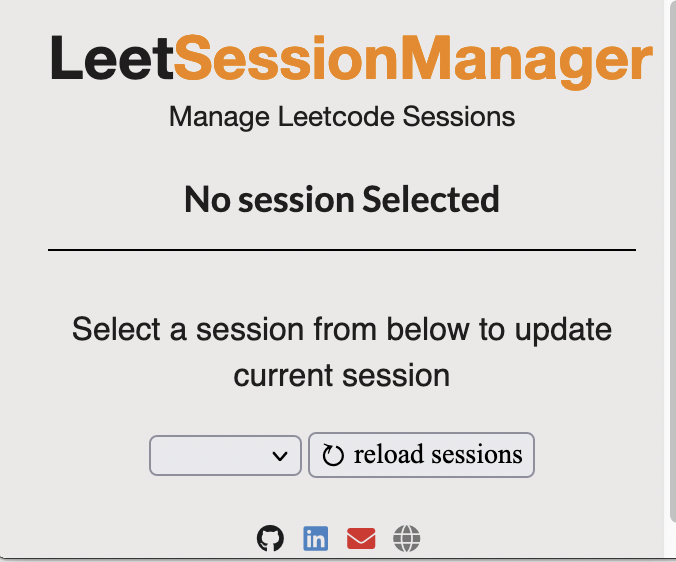
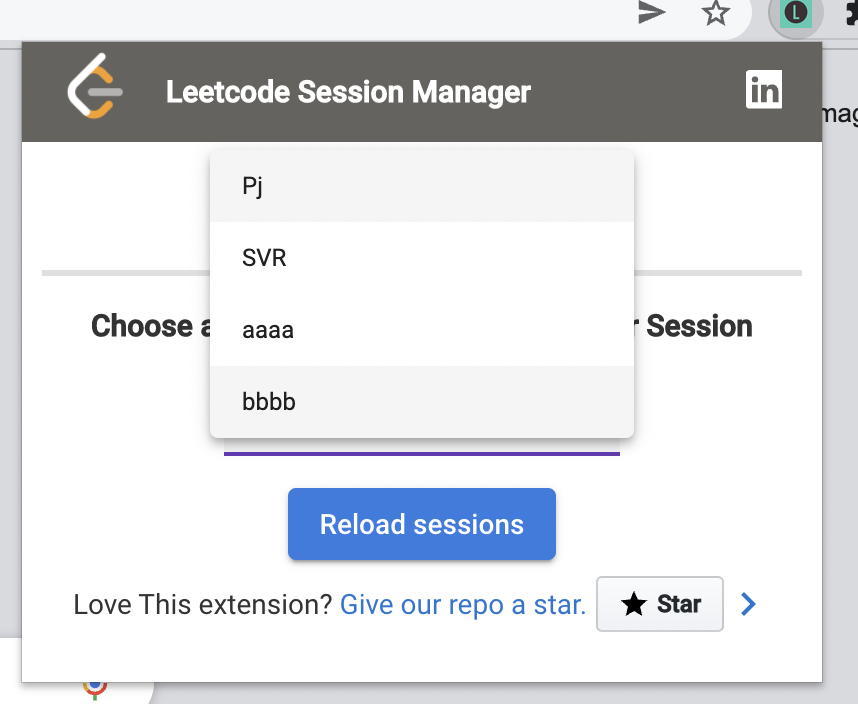
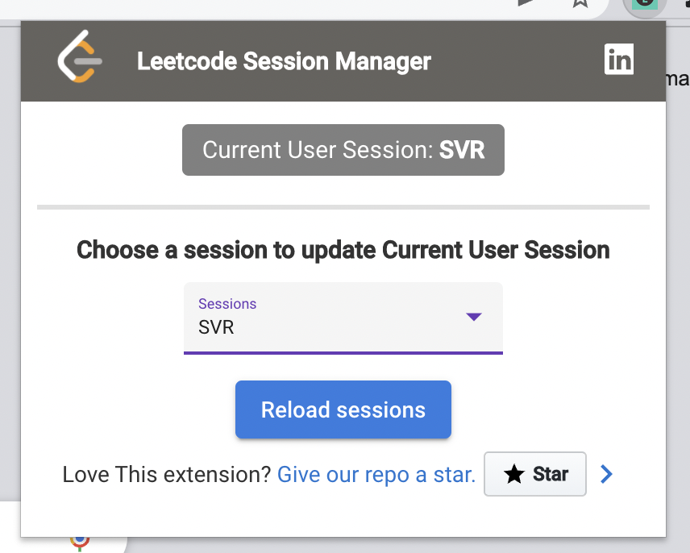

# LeetcodeSessionManager(Multiple users 1 leetcode premium account)

# About
This extension helps is multiple people using the same LeetCode account.

It gets tiring when you create sessions(sub-account in leetcode) to track an individual's progress, but as you already might have faced an issue that, if 2+ users are using the same account, the session(sub-account) is not device specific.

if User-1, activates his session in his device and at the same time you(User-2) solve a question and hit on submit, your submission gets logged inside User-1 session(sub-account).

How does this extension solve this issue?
you get to choose the session(sub-account) you want to track your submissions, and this extension will make sure, its tracked inside your chosen session.

# Installation guide:
Please head over to: [Installation section](https://github.com/pawanjenu/LeetcodeSessionManager/wiki/Install-extension)

# Usage:
* Please make sure that you are logged in to leetcode.com before using the extension.
* On the first run, no session is chosen, so please click on the the drop down and select the desired session.
* your all set, headover to leetcode.com and start solving.

### Note: in case new sessions are added to your account, please click on `reload session` in the extension to reflect the latest changes if not present.

# ScreenShots:
   
